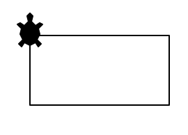

# Assignment for Session 5

## Reading and Writing Files

This assignment is the _"Mad Libs"_ exercise from chapter 8 in _Automate the Boring Stuff_, see https://automatetheboringstuff.com/chapter8/ in the bottom.

It says:

Create a Mad Libs program that reads in text files and lets the user add their own text anywhere the word `ADJECTIVE`, `NOUN`, `ADVERB`, or `VERB` appears in the text file. For example, a text file may look like this, see file `mad_libs.txt`:

```
The ADJECTIVE panda walked to the NOUN and then VERB. A nearby NOUN was
unaffected by these events.
```

The program would find these occurrences and prompt the user to replace them.

```
Enter an adjective:
silly
Enter a noun:
chandelier
Enter a verb:
screamed
Enter a noun:
pickup truck
```

The following text file would then be created:

```
The silly panda walked to the chandelier and then screamed. A nearby pickup
truck was unaffected by these events.
```

The results should be printed to the screen and saved to a new text file.


## Using an Object's Methods

  * Create a module `turtle_runner.py`, which will create a turtle graphics from a text file.
  * Let your program consume one argument from the command-line, which is a path to a script file.
    - A script file here is just a text file, see for example `script1.trtl`, `script2.trtl`, and `script3.trtl`.
    - Scripts contain only two entries per line, a _command_ and a _value_, separated by a space.
    - The only two commands any script can contain are `Walk` and `Turn`, 
  * Let your program read such a script file line by line and let it split each line's content on a space.
  * Assign the two resulting elements to two variables as in 
  ```python
  command, value = line.split(' ')
  ```
  * Convert the value in the variable called `value` into an `int`.
  * Write a function `def do_line(turtle, command, value):`, which lets a `turtle` object passed to the function `do_line` so what is given in
    - For example, when the command is `Walk` the you shall call the `turtle`s `forward` method with the argument given in `value`.
    - When the command is `Turn` the you shall call the `turtle`s `right` method with the argument given in `value`.

Consequently, running `python turtle_runner.py script1.trtl` shall produce an image as in the following:


Whereas running `python turtle_runner.py scrip3.trtl`




## Creating Classes

  * Create a module called `turtle_geometry.py`. 
  * In it create a class called `GeometryTurtle` which is a subclass of the class `Turtle` from the `turtle` module, see below.
  * Now, implement the methods `make_square(self, width)`, `make_rectangle(self, width, height)`, `make_triangle(self, length)`, and `make_star(self, length)` that let a turtle print the corresponding figures.

  * In the `main` function below you see the application of methods, some of which you implemented in your class `GeometryTurtle`, such as, `make_square`, `make_rectangle`, `make_triangle`, and `make_star` and some of which are inherited from the superclass `Turtle`, such as, `penup`, `forward`, `pendown`, and `right`.

```python
from turtle import Turtle, done


class GeometryTurtle(Turtle):
    # TODO: Implement me!!!
    pass


def main():
    my_turtle = GeometryTurtle()
    my_turtle.make_square(50)

    my_turtle.penup()
    my_turtle.forward(70)
    my_turtle.pendown()

    for i in range(6):
        my_turtle.right(60)
        my_turtle.make_square(30)

    my_turtle.penup()
    my_turtle.forward(70)
    my_turtle.pendown()

    my_turtle.make_rectangle(50, 20)

    my_turtle.penup()
    my_turtle.forward(70)
    my_turtle.pendown()

    my_turtle.make_triangle(50)

    my_turtle.penup()
    my_turtle.forward(70)
    my_turtle.pendown()

    my_turtle.make_star(49)

    # The call to the function `done` from the `turtle` module means that you
    # Have to close the window manually
    done()


if __name__ == '__main__':
    main()
```


Running the program `turtle_geometry.py` with your implementation via `python turtle_geometry.py`, should produce an image similar to the following:

